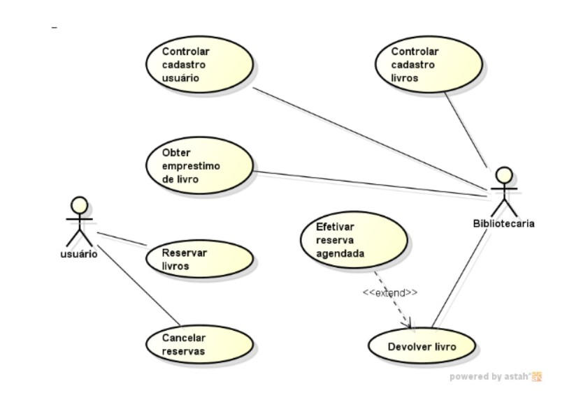

# LibManager

## Indice

- [LibManager](#libmanager)
  - [Indice](#indice)
  - [Visão Geral](#visao-geral)
  - [Definição do problema](#definição-do-problema)
  - [Requisitos](#requisitos)
  - [Caso de Uso](#caso-de-uso)
    - [**Atores:**](#atores)
    - [**Casos de Uso:**](#casos-de-uso)
  - [ToDo](#todo)
  - [Como Utilizar](#como-utilizar)

---
# Visão Geral

## **Simplifique sua gestão de livros e pessoas.**  

Com ele, você cadastra, empresta, devolve e organiza tudo em poucos cliques, com uma interface leve e intuitiva.  
Importe listas inteiras de livros e alunos, gerencie empréstimos e tenha controle total — sem depender de softwares caros ou complicados.  
O LibManager foi feito para liberar o seu tempo e transformar a organização em um aliado do seu sucesso.

### Conclusão

O LibManager representa mais do que a criação de um sistema: ele é a materialização de um propósito. Um propósito de facilitar a vida de quem precisa gerenciar acervos e registros, de promover o acesso à informação de forma mais estruturada e eficiente, e de transformar, de maneira prática, pequenos ambientes de leitura em grandes centros de conhecimento.

Seja para otimizar a gestão de uma biblioteca, apoiar projetos sociais, dinamizar o fluxo de informações em escolas, ou mesmo estruturar melhor acervos privados, o LibManager é a escolha inteligente.

**Organizar o saber é, antes de tudo, respeitar quem busca aprender. E é exatamente isso que o LibManager entrega.**

---

## Definição do problema

O problema com o gerenciamento atual da biblioteca de uma pequena escola é que ele não é eficiente. O sistema atual é baseado em planilhas e e-mails, o que torna difícil acompanhar os livros e outros materiais. Isso pode levar a problemas como livros perdidos ou danificados, multas não pagas e alunos que não conseguem encontrar os livros que precisam.

Uma solução que foi encontrada para esse problema é criar um sistema web. Esse sistema permitiria aos alunos e professores pesquisar livros, verificar livros, pagar multas e muito mais. O sistema também poderia ser usado para gerar relatórios sobre o uso da biblioteca, o que ajudaria a escola a tomar decisões sobre quais livros comprar e como alocar recursos.

O sistema web, seria uma solução eficiente para o problema. O sistema seria fácil de usar e manter, e ajudaria a escola a economizar tempo e dinheiro.

Aqui estão algumas das vantagens de usar um sistema web, para gerenciar uma biblioteca escolar:

- O sistema será fácil de usar e manter.
- O sistema ajudará a escola a economizar tempo e dinheiro.
- O sistema permitirá aos alunos e professores pesquisar livros, verificar livros, pagar multas e muito mais.
- O sistema poderá ser usado para gerar relatórios sobre o uso da biblioteca, o que ajudaria a escola a tomar decisões sobre quais livros comprar e como alocar recursos.

## Requisitos

- **Cadastro de Livros:**
  - Cadastro de informações dos livros, incluindo título, autor, editora.

- **Cadastro de Usuários:**
  - Cadastro de alunos, professores e funcionários com informações pessoais, número de identificação, etc.

- **Controle de Empréstimos e Devoluções:**
  - Registro de empréstimos de livros para usuários.
  - Data de empréstimo e data de devolução prevista.
  - Geração de recibos de empréstimos.

- **Pesquisa e Catálogo:**
  - Sistema de pesquisa que permite aos usuários buscar livros por título, autor, categoria.
  - Exibição de informações detalhadas do livro, incluindo disponibilidade.

- **Reservas de Livros:**
  - Capacidade de reservar livros que estão atualmente emprestados.

- **Relatórios e Estatísticas:**
  - Geração de relatórios sobre o uso da biblioteca, como livros mais emprestados, frequência de empréstimos, etc.

- **Gerenciamento de Estoque:**
  - Controle de estoque de livros, incluindo adição, remoção e atualização de exemplares.

- **Segurança e Autenticação:**
  - Segurança para proteger informações sensíveis dos usuários e garantir que apenas pessoal autorizado tenha acesso ao sistema.

- **Backup e Recuperação de Dados:**
  - Implementação de rotinas de backup para proteger os dados da biblioteca.

- **Suporte Técnico e Treinamento:**
  - Fornecimento de suporte técnico e treinamento para a equipe da biblioteca.

## Caso de Uso

### **Atores:**

1. **Usuário (Aluno/Professor/Funcionário):** Pessoas que utilizam o sistema para buscar, reservar e emprestar livros.

2. **Bibliotecário:** Responsável pela administração do sistema, incluindo cadastro de livros, gerenciamento de empréstimos, devoluções e geração de relatórios.

---

### **Casos de Uso:**

1. **Pesquisar Livros:**
   - **Ator Principal:** Usuário
   - **Descrição:** O usuário pode pesquisar livros no catálogo da biblioteca com base em critérios como título, autor, categoria, ISBN, etc.

2. **Realizar Empréstimo:**
   - **Ator Principal:** Usuário
   - **Descrição:** O usuário pode solicitar empréstimo de livros disponíveis na biblioteca. O sistema registra o empréstimo e gera um recibo.

3. **Realizar Devolução:**
   - **Ator Principal:** Usuário
   - **Descrição:** O usuário pode devolver os livros emprestados. O sistema atualiza o status do livro e calcula multas, se aplicável.

4. **Reservar Livro:**
   - **Ator Principal:** Usuário
   - **Descrição:** O usuário pode reservar um livro que está atualmente emprestado por outro usuário. O sistema notifica o usuário quando o livro estiver disponível.

5. **Cadastrar Livro:**
   - **Ator Principal:** Bibliotecário
   - **Descrição:** O bibliotecário pode cadastrar novos livros no sistema, incluindo informações como título, autor, ISBN, etc.

6. **Gerar Relatórios:**
   - **Ator Principal:** Bibliotecário
   - **Descrição:** O bibliotecário pode gerar relatórios sobre o uso da biblioteca, como os livros mais emprestados, frequência de empréstimos, multas, etc.

7. **Configurar Sistema:**
   - **Ator Principal:** Bibliotecário
   - **Descrição:** O bibliotecário pode personalizar as configurações do sistema, como prazos de empréstimo, políticas de multas, etc.

8. **Autenticar Usuário:**
   - **Ator Principal:** Sistema
   - **Descrição:** O sistema autentica os usuários (alunos, professores, funcionários) para acessar funcionalidades restritas.

---

## ToDo

- [X] Cadastro de Livros
- [X] Cadastro de Clientes
- [X] CI/ CD
- [X] Testes Unitários
- [X] Consertar o arquivo README.md
  - [X] Inserir instruções de como utilizar;
  - [X] Reinserir as imagens que se perderam nos processos durante as atualizações;

<!-- ## Pesquisar mais a fundo

Testes Unitarios: 
    `https://medium.com/@otaviobn/tdd-com-flask-e-unittest-3f66036a240b` -->

## Como Utilizar

  1. Clone o repositório.
  2. Acesse o diretório do repositório pelo terminal.
  3. Crie um Ambiente Virtual para o projeto, siga os passos abaixo:
     1. Linux
        Insira o comando `python3 -m venv env` e ative-o com `source venv/bin/activate`, no terminal.
     2. Windows
        Insira o comando `python -m venv env` e ative-o com `.\__LibManager\Scripts\activate` no prompt
  4. Instale as dependências necessárias com o comando `pip install -r requirements.txt`.
  5. Rode o comando `python app.py` para inicializar as dependências necessárias.
