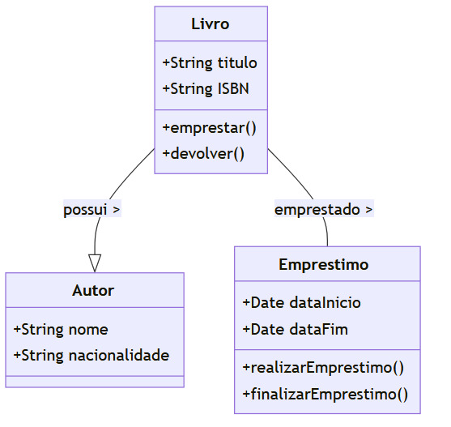

# Detalhes do projeto

## 1. Contexto (Context)

- **Nome:** LibManager
- **Objetivo:** Fornecer uma solução para gerenciar a coleção de livros de uma biblioteca escolar.
- **Stakeholders:** Bibliotecários, usuários da biblioteca.

---

## 2. Container (Contêiner)

- **Nome:** Aplicação da Biblioteca
  - **Tecnologias:** Programação web: Flask (Python);

  - **Responsabilidade:** Interface com o usuário, gerenciamento de pedidos, pesquisa de livros.

- **Nome:** Banco de Dados
  - **Tecnologia:** Banco de Dados Postgress
  - **Responsabilidade:** Armazenamento de informações sobre livros, autores, usuários e transações.

---

## 3. Componente (Component)

- **Nome:** Módulo de Autenticação
  - **Responsabilidade:** Gerenciar autenticação de usuários (login/logout).

- **Nome:** Módulo de Pesquisa
  - **Responsabilidade:** Permitir aos usuários pesquisar livros por título, autor, gênero.

- **Nome:** Módulo de Empréstimo
  - **Responsabilidade:** Permitir aos usuários solicitar empréstimo de livros.

- **Nome:** Módulo de Devolução
  - **Responsabilidade:** Gerenciar a devolução de livros emprestados.

---

<!-- ## 4. Código (Code)

- **Estrutura de Pacotes:**
  - `lib_manager`
    - `logs`: Contém os registros de acesso do servidor.
    - `migration`: Contém dados de migrações do banco.
    - `models\models`: Contém classes relacionadas ao banco de dados.
    - `static`:
    - `dbConfig`: Contém classes para acesso ao banco de dados. -->
